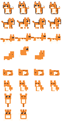

# 🐾 Taskbar Desktop Pet Companion

A super lightweight desktop companion designed to run along your Windows taskbar, perform cute actions, do micro-hops, and let you import custom sprite sheets or animated GIFs!

---

## ✨ Features

- **Lives Above Your Taskbar**: Automatically detects your Windows taskbar position (bottom, top, left, right) and screen work area. Your pet's feet walk right along the taskbar floor.
- **Ultra Lightweight**: Consumes only ~40MB RAM and negligible CPU using hardware-accelerated 32-bit ARGB transparency (no heavy browser or Electron runtime).
- **Default Companions Included**:
  - **Neko the Cat**: Ginger tabby that wanders, licks paws, does micro-jumps, and takes cozy catnaps.
  - **Bao the Panda**: Chubby giant panda that waddles, rolls/gallops, munches on fresh green bamboo shoots, and snoozes on its tummy.
- **Quick Pet Switching**: Right-click on the pet at any time and choose **🔄 Switch Pet** to swap between Neko, Bao, or any custom imported pets instantly!
- **Interactive Actions**:
  - **Walking & Running**: Explores back and forth along your taskbar path.
  - **Micro-Jumps**: Playful 2–4 pixel hops while walking or playing.
  - **Nap Time**: Curls up to sleep with floating `z Z Z` particles.
  - **Grooming / Snacking**: Cats lick their paws; Pandas munch on bamboo stalks!
  - **Drag & Drop with Gravity**: Pick up your pet by the scruff with your mouse and drop it anywhere on screen—it falls and lands softly back on the taskbar with dust puff effects!
  - **Petting**: Click your pet to show affection—hearts pop up and it does a happy bounce!
- **Sprite & Pet Manager**:
  - Import custom PNG sprite sheets or animated GIFs.
  - Interactive slicer with frame width/height, animation FPS, and live preview player.
- **Full Control**:
  - Right-click anywhere on the pet for quick actions, pet switching, scale (1x, 2x, 3x, 4x), speed, and settings.
  - Windows System Tray icon for persistent control even in click-through mode.

---

## 🚀 Quick Start

1. Double-click `run.bat` to launch the pet immediately!
   *(Or run via command line: `.venv\Scripts\python main.py`)*

2. **Controls**:
   - **Left Click**: Pet / Wake up (spawns love hearts).
   - **Click & Drag**: Pick up your pet and drop it anywhere on screen.
   - **Right Click**: Opens the Action Menu (force actions, resize, speed, import pets, quit).
   - **System Tray Icon**: Right-click the cat icon in the Windows taskbar tray to access settings or toggle Click-Through Mode.

---

## 🎨 Adding Custom Pets

1. Right-click the pet and select **🎨 Sprite & Pet Manager...**
2. Switch to the **✨ Import Custom Sprite** tab.
3. Browse for any PNG sprite sheet or animated GIF.
4. Adjust frame dimensions (e.g. 32x32, 48x48) or animation FPS with instant live preview.
5. Click **Save & Activate Pet**. Your new companion will appear on your taskbar immediately!
